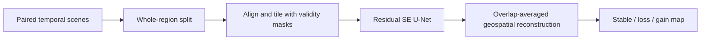

# Mangrove Change Segmentation

[](https://github.com/safouha/mangrove-change-segmentation/actions/workflows/ci.yml)
[](https://www.python.org/downloads/)
[](LICENSE)

A reproducible geospatial pipeline for learning next-year mangrove masks from satellite
embeddings, comparing masks across time, and reporting gain or loss without spatial data
leakage.

The repository turns an exploratory remote-sensing workflow into a reusable Python package.
It deliberately separates lightweight array logic from optional Rasterio and TensorFlow
components, so configuration, splitting, tiling, metrics, and change analysis can be tested
without a GPU or geospatial system libraries.

## Why this pipeline is careful

- **Region-level isolation:** every tile from a geographic region stays in exactly one of
  train, validation, or test. Nearby overlapping tiles cannot leak across splits.
- **Stable experiments:** SHA-256 ranking makes split assignment and negative-tile sampling
  independent of input order and Python's random implementation. The chosen split is saved.
- **Correct raster semantics:** continuous feature bands use bilinear reprojection; categorical
  labels and validity masks are never interpolated.
- **Explicit missing-data handling:** invalid pixels are carried into encoded training targets
  and excluded by the supplied losses and metrics.
- **Class-imbalance controls:** all positive tiles are retained while background-only training
  tiles are capped deterministically per region.
- **Large-scene inference:** overlapping tile predictions are averaged rather than overwritten,
  eliminating seams caused by last-tile wins.
- **Auditable change output:** background, stable mangrove, loss, gain, and invalid pixels have
  fixed codes, with raw counts and percentage change reported separately.

No dataset, trained weights, or benchmark score is bundled. Reported performance should come
from a held-out region in the user's own data, not from an undocumented experiment.

## Pipeline



The temporal pairing is explicit: features from each configured year are paired with the label
from the following configured year. For years `[2017, 2018, 2019, 2020]`, the package builds
2017→2018, 2018→2019, and 2019→2020 examples.

## Install

Python 3.11 or newer is required.

```bash
python -m venv .venv
source .venv/bin/activate
pip install -e .
```

Add only the capabilities you need:

```bash
pip install -e '.[geo]'      # Raster preparation and GeoTIFF output
pip install -e '.[ml]'       # TensorFlow model and training
pip install -e '.[all,dev]'  # Full development environment
```

## Data layout

The example configuration expects the following structure. Region names and years are declared
in TOML, so directory scanning cannot silently add data to an experiment.

```text
data/
├── embeddings/
│   ├── region-a/2017.tif
│   ├── region-a/2018.tif
│   └── ...
└── labels/
    ├── region-a/2018.tif
    ├── region-a/2019.tif
    └── ...
```

Feature rasters may contain any configured number of continuous bands. Label rasters are read as
binary masks (`> 0` means mangrove). Both rasters need a coordinate reference system. The label
grid is the reference grid for alignment.

## Quick start

Copy and edit the annotated configuration:

```bash
cp examples/project.toml project.toml

# Check schema and preview the deterministic split before downloading data.
mangrove-seg validate project.toml --config-only
mangrove-seg split project.toml

# Validate every expected temporal pair, then prepare NumPy tiles.
mangrove-seg validate project.toml
mangrove-seg prepare project.toml

# Requires the TensorFlow extra.
mangrove-seg train project.toml
```

Preparation writes portable `.npy` arrays and JSON Lines manifests under `tiles_root`, plus a
frozen `region-split.json` under `artifacts_root`. Existing tiles are protected by default;
`--overwrite` must be supplied deliberately.

## Evaluate predictions and summarize change

Evaluation accepts NumPy arrays so it can be used with this model or another inference stack:

```bash
mangrove-seg metrics labels.npy probabilities.npy \
  --valid-mask valid.npy --threshold 0.5

mangrove-seg change mask-2019.npy mask-2020.npy \
  --valid-mask valid.npy --output change-map.npy
```

`metrics` reports the confusion matrix, accuracy, precision, recall, specificity, F1, and IoU.
`change` emits counts for stable mangrove, loss, and gain. Pixel counts are intentionally not
converted to area without a known raster transform and projected unit.

## Model

`build_unet` creates a configurable residual U-Net with squeeze-and-excitation channel attention,
spatial dropout, skip connections, and up to two auxiliary supervision heads. The default loss
combines focal and Dice terms; a Lovasz hinge option is available for IoU-oriented fine-tuning.
Both losses understand `[label, valid_pixel]` targets and ignore nodata areas.

See [docs/architecture.md](docs/architecture.md) for component boundaries, invariants, and
extension points.

## Development

```bash
pip install -e '.[dev]'
pytest
ruff format --check .
ruff check .
mypy
python -m build
```

The default test suite does not require Rasterio or TensorFlow. Optional integrations are loaded
only by commands that need them, and missing extras produce actionable installation messages.

## Scope and limitations

This is research software, not an operational conservation or land-use decision system. Satellite
embeddings and reference masks can contain temporal, geographic, and labeling bias. A deployment
needs region-held-out validation, threshold calibration, uncertainty analysis, and review against
independent ground truth. Dataset licenses and attribution requirements remain the responsibility
of the data user.

## License

Source code is available under the [MIT License](LICENSE).
